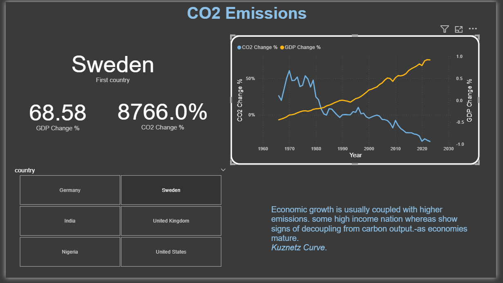
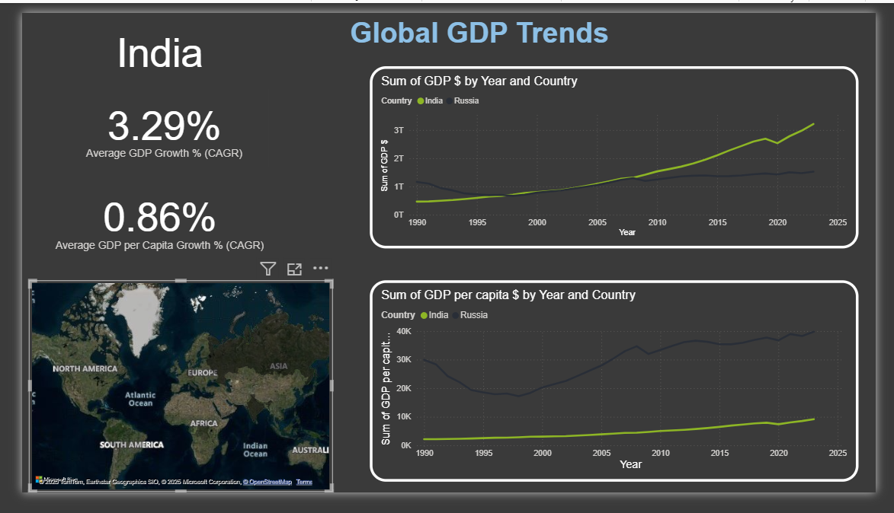

# 🌍 Global Economic Dashboard – Power BI

This Power BI project provides an interactive analysis of **global GDP trends**, **CO₂ emissions**, and **life expectancy** across multiple countries. The goal is to explore how **economic growth correlates with environmental sustainability and human well-being**, highlighting key insights such as **decoupling trends** and **development patterns**.

---

## 📌 Key Features

### 1️⃣ CO₂ Emissions vs GDP
- Country-wise comparison of **CO₂ Change %** and **GDP Change %** over time.
- Visual exploration of **decoupling patterns** — e.g., countries like *Sweden* showing **economic growth with declining emissions**, aligning with the **Kuznets Curve hypothesis**.

### 2️⃣ Life Expectancy & Economic Prosperity
- Multi-country comparison of **GDP vs Life Expectancy** trends.
- Gauge visualization showing the **current life expectancy** of the selected country.
- Insight card summarizing how **wealth correlates with longevity** due to better **healthcare and living standards**.

### 3️⃣ Global GDP Trends (CAGR-Based View)
- Analysis of **Average GDP Growth %** and **GDP Per Capita Growth %**.
- Dual-line visualizations comparing **emerging vs developed economies**.
- **Map integration** for geographical context.

---

## 🛠️ Tech Stack

| Tool / Language | Purpose |
|----------------|---------|
| **Power BI** | Data Visualization & Dashboard Design |
| **DAX** | Calculations & Measures (CAGR, Growth %) |
| **Excel / CSV** *(assumed)* | Data Source |
| **Map / Line / Gauge Visuals** | Storytelling Through Interactive Charts |

---

## 📸 Dashboard Previews

| CO₂ Emissions | Life Expectancy | Global GDP Trends |
|---------------|----------------|------------------|
|  |  |  |

---

## 📊 Insights & Observations

✅ **High-income economies** like **Sweden** demonstrate that **economic prosperity doesn’t always require higher emissions**.  
✅ **Developing countries** often show **rapid GDP growth** but **slower improvements in life expectancy**, indicating **structural inequality or healthcare gaps**.  
✅ **GDP Per Capita** rises **much slower** than overall **GDP in emerging markets**, reflecting **population impact**.  

---

## 🚀 How to Use

1. Open the `.pbix` file in **Power BI Desktop**.
2. Use **dropdown filters** to switch between countries.
3. Hover over line charts for **historical trend values**.
4. Observe **growth vs sustainability trade-offs**.

---

## 📌 Future Enhancements

- Add **renewable energy % share** comparison.
- Include **Human Development Index (HDI)**.
- Integrate **forecasting models** for emissions or GDP.

---

## 📬 Author

**Your Name**  
*Data Analyst / Power BI Developer*  
🔗 *[LinkedIn or Portfolio Link]*

